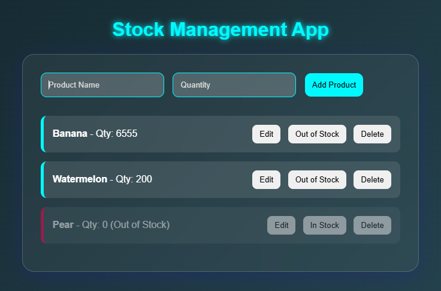

 Stock Managment Application

 This application was created by the NCI student of Bachelor of Science (Honours) in Computing Information for the DevOpsSec Module to showcase the students ability to collabolate together in a CI/CD pipeline making changes in code, commit, test, and deploy without failing the pipeline or debugging when it does so.
 The program is a Stock Managment Application that handles CRUD operation by taking product name and quantity input from the user and listing them on the screen, once a product is created the user can edit product details, mark it as out of stock, or delete the product.
 The application is hosted by AWS EC2

Technologies Used:

HTML, CSS, JavaScript, CircleCI CI/CD Pipeline, AWS EC2.

Developer:

Aloisio(Ali) Pereira Junior
Email address:
x21211027@outlook.com 
